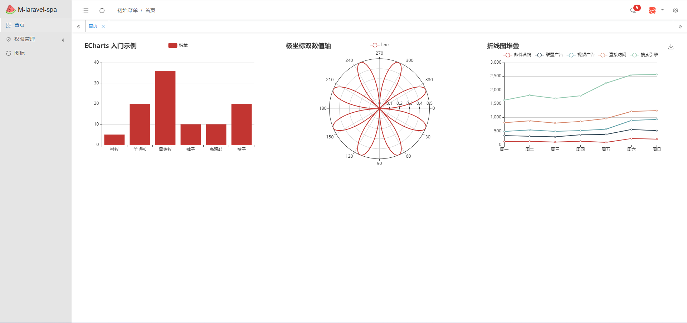
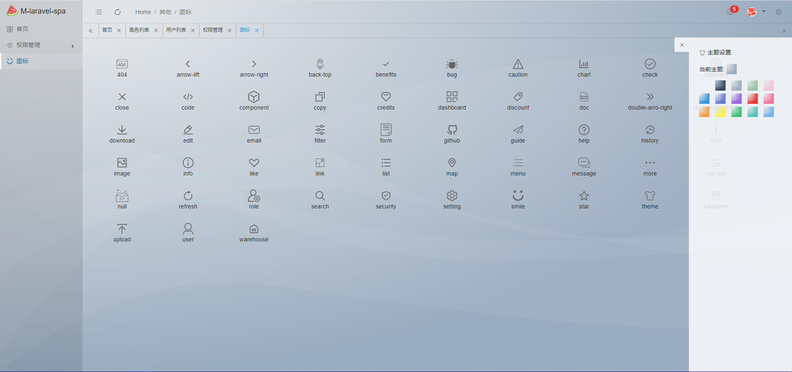
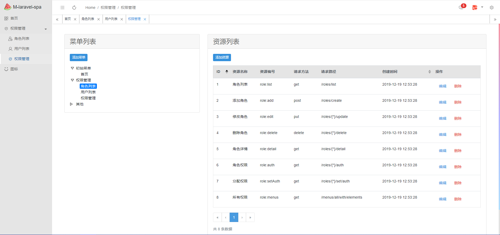
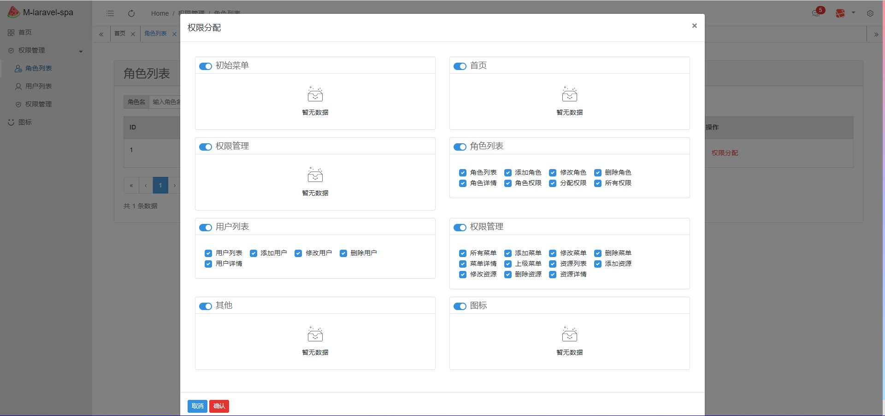
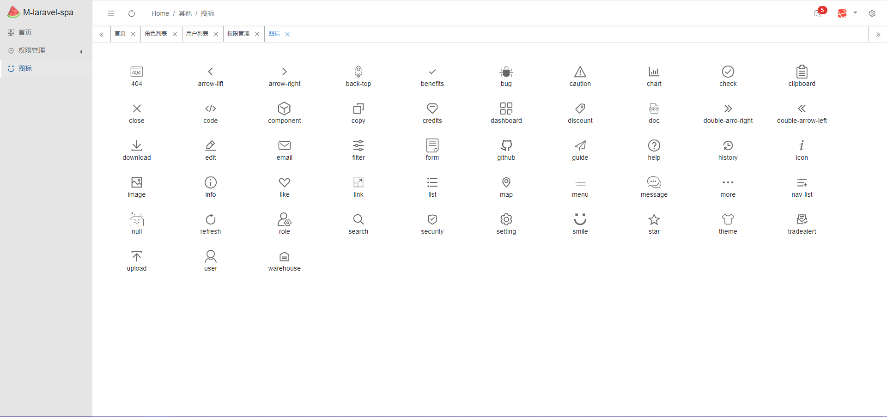

# laravel vue 单页式管理后台

基于 laravel 和 bootstrap-vue 的单页式管理后台。

爬坑无数，吐血开发中。

容易纠结，进度很慢。

[ [ 开发进度 ] ](https://github.com/m-finder/laravel-spa/projects/1)

#### 特征
* 使用 laravel 内置的 mix 编译 vue 程序，不独立拆分
* 多主题
* 多标签页
* 画风中规中矩，布局简洁大方
* 基于角色，权限，用户的权限管理
* 路由懒加载


想提前预览可以安装下看看，或者看最下方截图。
#### 安装
```
git clone https://github.com/m-finder/laravel-spa.git

cp .env-example .env
composer install
npm install
php artisan key:generate
vi .env

php artisan migrate:fresh --seed
npm run watch-poll

localhost/admin
account: yf-wu@qq.com
password: 111111
```
#### 截图
> 登录页面。


> 首页，图表为静态数据，占坑中，非最终版本。


> 主题设置。


> 权限管理


> 角色权限分配


> svg 图标


